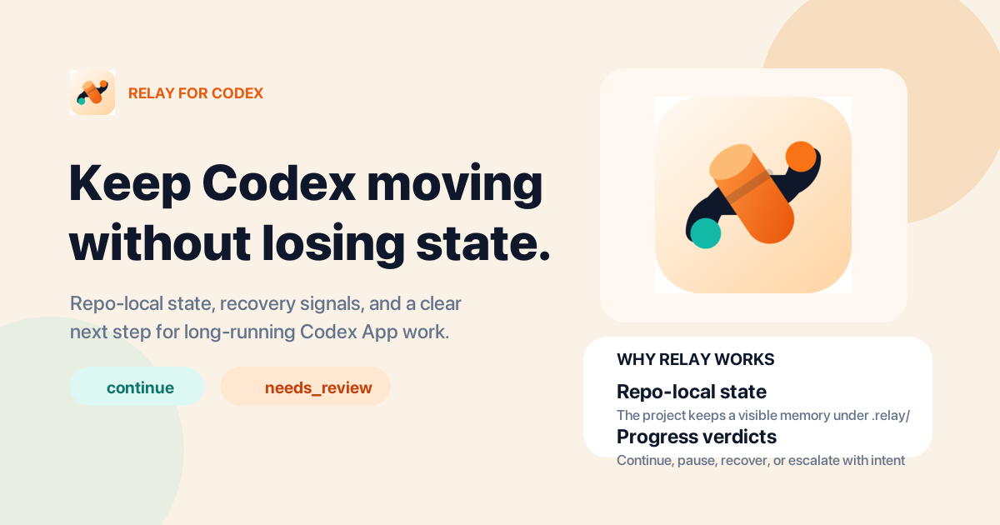

# Relay for Codex



[](https://github.com/Ryan-Guo123/relay-codex/actions/workflows/tests.yml)
[](LICENSE)
[](plugins/relay-codex/.codex-plugin/plugin.json)
[](https://github.com/Ryan-Guo123/relay-codex/stargazers)

Keep Codex moving on your project without losing state.

Relay for Codex is an App-native project relay for heavy Codex workflows. It gives Codex a repo-local memory, a progress verdict, recovery heuristics, and automation packs so long-running work stops drifting, looping, or asking the same question twice.

If Relay saves you from session drift or endless test churn, give the repo a star.

## Why this exists

Codex can move fast inside a thread. The failure mode starts later:

- the thread loses context
- the repo has no durable task memory
- the agent keeps testing instead of progressing
- you cannot tell whether Codex should continue, pause, recover, or ask for help

Relay adds a thin control layer on top of Codex App:

- repo-local state under `.relay/`
- a four-state verdict:
  - `continue`
  - `paused`
  - `needs_human`
  - `needs_review`
- lightweight hooks for activity tracking
- recovery-first behavior when work starts to churn
- automation packs that keep checking the project after the current thread goes quiet

## What makes Relay different

- App-native, not CLI-first
  - Relay is built around Codex App primitives such as skills, hooks, automations, and review-oriented follow-up.
- Repo-local and handoff-friendly
  - Project state lives in files that another human or agent can inspect.
- Built to catch churn
  - Repeated failures, test-only loops, and stalled progress are treated as signals, not “keep going harder” instructions.
- Small surface area
  - Relay focuses on keeping work moving. It does not try to become another prompt marketplace or agent framework.

## Core pieces

### 1. Project Relay

Turns the current repository into a Relay-managed workspace by creating:

- `.relay/mission.md`
- `.relay/state.md`
- `.relay/queue.md`
- `.relay/guardrails.md`
- `.relay/automations.md`
- `.relay/events.jsonl`

### 2. Progress Monitor

The runtime inspects repo context, recent events, and repeated failure patterns to decide whether Codex should:

- continue
- pause
- escalate to a human
- switch into recovery mode

### 3. Automation Packs

Relay renders three starter packs:

- `Continue Working`
  - Check the repo regularly and only create a new Codex follow-up when the verdict still says `continue`.
- `Daily Triage`
  - Produce a concise daily project status summary.
- `Stuck Recovery`
  - Generate a recovery brief when the project starts looping or failing repeatedly.

## How it works

1. Install `Relay for Codex`.
2. In a repo, run `Enable Relay in this repo`.
3. Relay creates `.relay/` and infers the project stack, commands, queue, and guardrails.
4. The `PostToolUse` hook records events into `.relay/events.jsonl`.
5. `inspect-relay-state` or `continue-with-relay` uses the latest verdict before doing more work.
6. `recover-stuck-project` rewrites the queue into smaller, recovery-first steps when the repo is stuck.
7. `install-relay-automations` turns the current state into repeatable Codex App follow-up.

## Example `.relay/` snapshot

```text
.relay/
  mission.md       -> What this repo is trying to achieve
  state.md         -> Current verdict, recent progress, current blockers
  queue.md         -> The next concrete tasks
  guardrails.md    -> When to stop, escalate, or recover
  automations.md   -> Suggested automation packs
  events.jsonl     -> Lightweight event log from hooks
```

## Quick start

### Option A: use the local plugin bundle

1. Clone this repository.
2. Make sure the local marketplace entry remains available at `.agents/plugins/marketplace.json`.
3. Open the workspace in Codex App and install `Relay for Codex`.
4. In the target repository, use `Enable Relay in this repo`.

### Option B: develop the plugin itself

1. Open this repository in Codex App.
2. Edit files under `plugins/relay-codex/`.
3. Run the validation suite:

```bash
python3 -m unittest discover -s tests -p 'test_*.py'
```

## Included skills

- `enable-relay`
- `continue-with-relay`
- `inspect-relay-state`
- `recover-stuck-project`
- `install-relay-automations`

## Repository layout

```text
.agents/plugins/marketplace.json
plugins/relay-codex/
  .codex-plugin/plugin.json
  assets/
  hooks.json
  scripts/relay_runtime.py
  skills/
tests/
docs/
```

## Current status

Relay is intentionally narrow in v1. It already covers:

- repo-local state bootstrapping
- hook-driven event tracking
- stuck-project detection
- recovery queue generation
- automation pack rendering
- fixture-backed tests for empty, in-progress, and stuck repositories

Planned next:

- richer install UX
- better screenshots and real-world demos
- more opinionated automation setup
- stronger review queue handoff patterns

## Contributing

Bug reports, repro cases, workflow ideas, and pull requests are welcome. Start with [CONTRIBUTING.md](CONTRIBUTING.md).

## Launch notes

If you want this project to travel, do not just ship code. Ship a clear before/after story, a real stuck-repo demo, and a short clip that shows Relay changing the verdict from churn to recovery. A maintainer-facing launch checklist lives in [docs/launch-playbook.md](docs/launch-playbook.md).

## 中文简介

Relay for Codex 是一个专门为 Codex App 设计的项目推进插件。它不是另一个 prompt 包，也不是 CLI loop 的移植版，而是给 Codex 增加一层“项目状态控制”：

- 把项目状态落到仓库本地的 `.relay/` 文件里
- 自动判断现在应该继续、暂停、需要人工，还是进入恢复模式
- 在发现反复失败、空转测试、重复提问时，不再盲目继续跑
- 给出适合 Codex App 的 automation packs

### 它解决的问题

- Codex 做长任务时容易丢状态
- 线程结束后没有可持续的项目记忆
- 经常出现“在测，但没有推进”
- 你看不出来现在到底该继续，还是该停下来处理卡点

### 快速开始

1. 安装 `Relay for Codex`
2. 在仓库里执行 `Enable Relay in this repo`
3. 查看生成的 `.relay/` 文件
4. 按需要继续使用：
   - `inspect-relay-state`
   - `continue-with-relay`
   - `recover-stuck-project`
   - `install-relay-automations`

### 为什么更容易被 star

因为它讲的不是“更多 agent 配置”，而是一个更具体的结果：

- 让 Codex 在长任务里不容易跑偏
- 让仓库里有可见、可交接、可继续推进的状态
- 让用户知道什么时候该继续，什么时候该停

License: MIT
