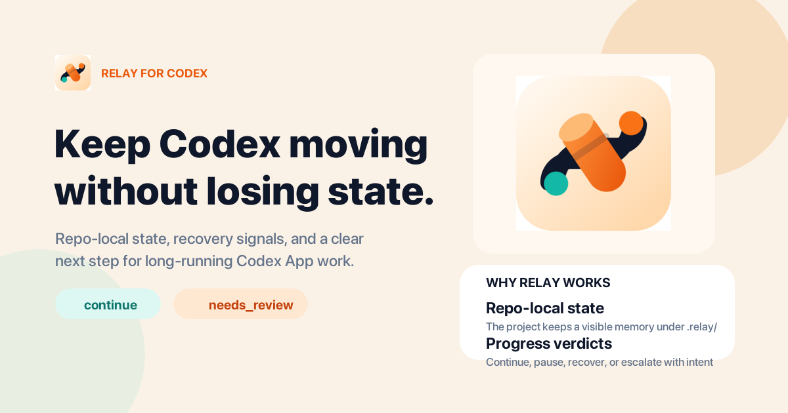
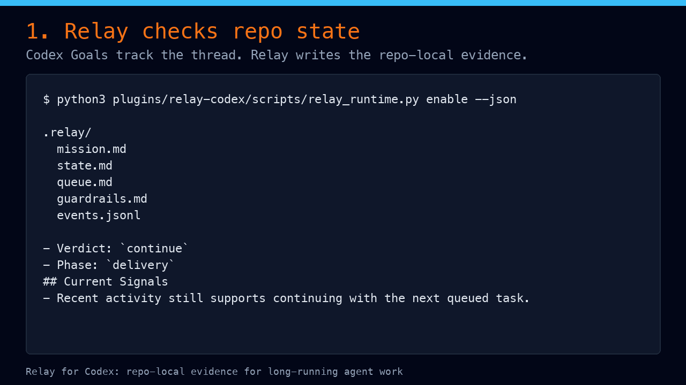

# Relay for Codex



[](https://github.com/Ryan-Guo123/relay-codex/actions/workflows/tests.yml)
[](LICENSE)
[](plugins/relay-codex/.codex-plugin/plugin.json)
[](https://github.com/Ryan-Guo123/relay-codex/stargazers)

Relay for Codex is an open-source maintainer workflow layer for long-running Codex work: triage, review, stuck recovery, and release handoff.

Relay does not try to run agents, replace Codex Goals, become another kanban board, or compete with local-first memory tools. It is a narrow Codex App-native handoff adapter: after a Codex run, it produces GitHub-ready maintainer artifacts inside the repo.



If Relay saves you from session drift or endless test churn, give the repo a star.

Outside reviewers wanted: if you review AI-generated PRs, use [docs/reviewers-wanted.md](docs/reviewers-wanted.md) to test a generated handoff, skim the [Round 1 reviewer request](docs/round1-reviewer-request.md), or skim the [sample reviewer pack](docs/reviewer-pack-example.md), then file a `Relay handoff feedback` issue. Blunt negative feedback is welcome.

## Why this exists

Codex Goals can keep work moving inside a thread. The failure mode starts later, when that work has to become something a maintainer can review, merge, or release:

- the thread summary is hard to reuse in GitHub
- the PR description misses evidence, risks, or review notes
- release readiness lives in chat instead of the repo
- a future maintainer cannot tell what changed, what was checked, and what still needs review

Relay exists for the moment after a Codex Goal or agent run:

```text
issue/task -> Codex Goal/run -> repo evidence -> PR comment or release gate
```

It answers one maintainer question:

> "What can I paste into GitHub so a maintainer understands what happened, what was checked, and what still needs review?"

Relay adds a thin repo-local packaging layer on top of Codex App:

- repo-local state under `.relay/`
- a four-state verdict:
  - `continue`
  - `paused`
  - `needs_human`
  - `needs_review`
- lightweight hooks for activity tracking
- recovery notes when work starts to churn
- PR comment, review-readiness, reviewer pack, handoff, and release artifacts that can be reused in GitHub
- validation briefs that make outside reviewer asks concrete and measurable

## Is this already solved?

Partly. The agent-tooling market is crowded:

- Codex Goals track a thread-scoped objective and completion contract.
- Claude Managed Agents and OpenAI Symphony point toward hosted or orchestrated long-running agent work.
- Paperclip, vibe-kanban, and Warp-style workflows make agent work visible through dashboards, boards, branches, and PR UI.
- agentmemory stores broad cross-agent recall.
- skills packs package reusable engineering workflows.
- AI PR review tools such as Copilot code review, CodeRabbit, Graphite, Qodo, and PR-Agent already own inline review comments and suggested fixes.

Relay should not compete with those layers.

Relay's narrow job is downstream of them: after an agent run touches a repository, Relay writes the maintainer evidence that should survive the session.

```text
Not:  "Run my agents."
Not:  "Remember everything."
Not:  "Replace my issue tracker."
Yes:  "Turn this Codex run into a maintainer-readable PR or release handoff."
```

If that handoff is not better than asking Codex to summarize the thread, Relay should shrink, pivot, or stop. The current product bet is intentionally small.

## What makes Relay different

- App-native, not CLI-first
  - Relay is built around Codex App primitives such as skills, hooks, automations, and review-oriented follow-up.
- Repo-local and handoff-friendly
  - Project state lives in files that another human or agent can inspect.
- Built to catch churn
  - Repeated failures, test-only loops, and stalled progress are treated as signals, not “keep going harder” instructions.
- Small surface area
  - Relay focuses on keeping work moving. It does not try to become another prompt marketplace or agent framework.

The product strategy lives in [docs/product-strategy.md](docs/product-strategy.md), the stricter market map lives in [docs/market-map.md](docs/market-map.md), community pain research lives in [docs/community-research.md](docs/community-research.md), the evidence and business case lives in [docs/evidence-and-business-case.md](docs/evidence-and-business-case.md), the validation ledger lives in [docs/validation-ledger.md](docs/validation-ledger.md), feedback triage lives in [docs/feedback-triage.md](docs/feedback-triage.md), the Round 1 experiment lives in [docs/round1-experiment.md](docs/round1-experiment.md), the validation plan lives in [docs/validation-plan.md](docs/validation-plan.md), outside-review guidance lives in [docs/external-maintainer-validation.md](docs/external-maintainer-validation.md), and the `.relay/` artifact protocol lives in [docs/relay-protocol.md](docs/relay-protocol.md). The short version: Relay should be a GitHub handoff adapter for Codex-heavy work, not a clone of broader multi-agent control planes, memory engines, or local-first evidence ledgers.

## Core pieces

### 1. Project Relay

Turns the current repository into a Relay-managed workspace by creating:

- `.relay/mission.md`
- `.relay/state.md`
- `.relay/queue.md`
- `.relay/guardrails.md`
- `.relay/automations.md`
- `.relay/events.jsonl`

### 2. Handoff Monitor

The runtime inspects repo context, recent events, and repeated failure patterns to package the current work state as:

- continue
- pause
- escalate to a human
- switch into recovery mode

That status is an input to PR and release handoff, not a replacement for Codex Goals.

### 3. Automation Packs

Relay renders three starter packs:

- `Continue Working`
  - Preserve a clear follow-up note when the repo state says more work is safe.
- `Daily Triage`
  - Produce a concise daily project status summary.
- `Stuck Recovery`
  - Generate a recovery brief when the project starts looping or failing repeatedly.

## How it works

1. Install `Relay for Codex`.
2. In a repo, run `Enable Relay in this repo`.
3. Relay creates `.relay/` and infers the project stack, commands, queue, and guardrails.
4. The `PostToolUse` hook records events into `.relay/events.jsonl`.
5. `inspect-relay-state` or `continue-with-relay` reads the latest verdict before more work is requested.
6. `recover-stuck-project` rewrites the queue into smaller, recovery-first steps when the repo is stuck.
7. `generate-relay-handoff` writes `.relay/handoff.md` for PR, release, or future-Codex pickup.
8. `generate-review-readiness` writes `.relay/review-readiness.md` as a review routing gate.
9. `generate-pr-comment` writes `.relay/pr-comment.md` as a pasteable GitHub review note.
10. `generate-reviewer-pack` writes `.relay/reviewer-pack.md` for outside maintainer validation.
11. `generate-validation-brief` writes `.relay/validation-brief.md` before asking an outside reviewer for evidence.
12. `generate-release-checklist` writes `.relay/release-checklist.md` before tags or GitHub releases.
13. `install-relay-automations` turns the current state into repeatable Codex App follow-up.

## Example `.relay/` snapshot

```text
.relay/
  mission.md       -> What this repo is trying to achieve
  state.md         -> Current verdict, recent progress, current blockers
  queue.md         -> The next concrete tasks
  guardrails.md    -> When to stop, escalate, or recover
  handoff.md       -> Maintainer-ready PR or release handoff
  review-readiness.md -> Changed-file scope, sensitive paths, and reviewer routing
  pr-comment.md    -> GitHub-ready PR review comment draft
  reviewer-pack.md -> Outside reviewer prompt, rubric, and handoff excerpt
  validation-brief.md -> Outside validation ask, reviewer pack, and ledger instructions
  release-checklist.md -> Verification, versioning, tag, and approval steps
  automations.md   -> Suggested automation packs
  events.jsonl     -> Lightweight event log from hooks
```

## Quick start

### Option A: use the local plugin bundle

1. Clone this repository.
2. Make sure the local marketplace entry remains available at `.agents/plugins/marketplace.json`.
3. Open the workspace in Codex App and install `Relay for Codex`.
4. In the target repository, use `Enable Relay in this repo`.

For full setup steps, success checks, and troubleshooting, see [docs/install.md](docs/install.md).

See [docs/demo-usage.md](docs/demo-usage.md) for a concrete PR triage flow, [docs/pr-handoff-example.md](docs/pr-handoff-example.md) for the first fixture-backed GitHub PR handoff, and [docs/stuck-recovery-walkthrough.md](docs/stuck-recovery-walkthrough.md) for the `continue -> needs_review -> recovery handoff` path. The demo GIF is generated from real Relay runtime output; its storyboard and acceptance criteria live in [docs/demo-storyboard.md](docs/demo-storyboard.md).

If you are reviewing Relay from outside the project, start with [docs/reviewers-wanted.md](docs/reviewers-wanted.md), skim [docs/reviewer-pack-example.md](docs/reviewer-pack-example.md), then use [docs/external-maintainer-validation.md](docs/external-maintainer-validation.md) and the `Relay handoff feedback` issue template. If you are sharing the request, [docs/outreach-copy.md](docs/outreach-copy.md) has short drafts. Honest "ignored" or "confusing" feedback is more useful than polite praise.

### Option B: develop the plugin itself

1. Open this repository in Codex App.
2. Edit files under `plugins/relay-codex/`.
3. Run the validation suite:

```bash
python3 -m unittest discover -s tests -p 'test_*.py'
```

## Included skills

- `enable-relay`
- `continue-with-relay`
- `inspect-relay-state`
- `recover-stuck-project`
- `generate-relay-handoff`
- `generate-review-readiness`
- `generate-pr-comment`
- `generate-reviewer-pack`
- `generate-validation-brief`
- `generate-release-checklist`
- `install-relay-automations`

## Repository layout

```text
.agents/plugins/marketplace.json
plugins/relay-codex/
  .codex-plugin/plugin.json
  assets/
  hooks.json
  scripts/relay_runtime.py
  skills/
tests/
docs/
tools/
```

## Current status

Relay is intentionally narrow in v1. It already covers:

- repo-local state bootstrapping
- hook-driven event tracking
- stuck-project detection
- recovery queue generation
- maintainer handoff generation
- standalone review-readiness artifact generation
- GitHub PR comment generation
- review-readiness signals for changed-file count, sensitive paths, and CODEOWNERS routing
- outside reviewer pack generation
- outside validation brief generation
- release checklist generation
- stuck recovery walkthrough from real runtime output
- automation pack rendering
- fixture-backed tests for empty, in-progress, and stuck repositories

Planned next:

- packaged marketplace distribution once the plugin leaves local-bundle install
- higher-quality narrated walkthrough after the first runtime-generated GIF
- validation workflows for PR handoff, stuck recovery, and release handoff
- outside maintainer feedback through the `Relay handoff feedback` issue template
- more opinionated automation setup
- stronger review queue handoff patterns
- a tighter boundary with Codex's native goal and continuation features

## Contributing

Bug reports, repro cases, workflow ideas, and pull requests are welcome. Start with [CONTRIBUTING.md](CONTRIBUTING.md). Security boundaries and reporting guidance live in [SECURITY.md](SECURITY.md).

## Launch notes

If you want this project to travel, do not just ship code. Ship a clear before/after story, a real PR/release handoff demo, and a short clip that shows Relay turning Codex work into a maintainer-readable artifact. A maintainer-facing launch checklist lives in [docs/launch-playbook.md](docs/launch-playbook.md), and the first runtime-generated demo lives in [docs/assets/relay-demo.gif](docs/assets/relay-demo.gif).

## 中文简介

Relay for Codex 是一个专门为 Codex App 设计的维护者交接插件。它不是另一个 prompt 包，也不是 Codex Goals 的替代品，而是在 Codex 跑完之后，把工作整理成 GitHub PR / release 能直接复用的交接材料：

- 把项目状态落到仓库本地的 `.relay/` 文件里
- 把验证、风险、review focus 和下一步写成可审阅的 handoff
- 在发现反复失败、空转测试、重复提问时，明确标出需要人工 review 的点
- 给出适合 PR 更新、release checklist 和后续 Codex App 跟进的材料

### 它解决的问题

- Codex 线程里的结论很难直接搬到 GitHub
- PR 描述容易漏掉测试、风险和人工 review 点
- release 前的检查步骤散落在聊天记录里
- 后来的维护者不知道哪些已经做过、哪些还需要看

### 快速开始

1. 安装 `Relay for Codex`
2. 在仓库里执行 `Enable Relay in this repo`
3. 查看生成的 `.relay/` 文件
4. 按需要继续使用：
   - `inspect-relay-state`
   - `continue-with-relay`
   - `recover-stuck-project`
   - `install-relay-automations`

### 为什么值得继续验证

因为它讲的不是“再造一个 agent runtime”，而是一个更具体的结果：

- 把 Codex 的长任务输出变成维护者能审阅的 GitHub 交接物
- 让仓库里有可见、可交接、可发布前检查的状态
- 避开 Codex Goals、memory tools 和 kanban products 已经占住的地盘

现在还不能声称它会自然获得很多 star、赞助或收入；这些必须由外部 reviewer 的 `reused`、`edited_heavily`、`ignored` 或 `confusing` 反馈来验证。

License: MIT
